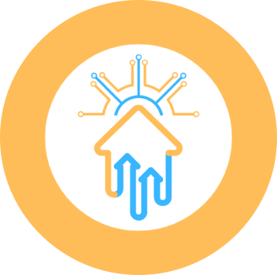

## 
HouseSpot

  

#### 
Your Home Needs with One Touch!

This project aims to fulfill the requirements of the <strong><a href="https://grow.google/intl/id_id/bangkit/?tab=machine-learning">Bangkit Academy led by Google, Tokopedia, Gojek, & Traveloka</a></strong>.

    <a href="https://docs.google.com/document/d/11ubYQR9-_l_VYlyfzQa-apOHgtIcCo5Nf6tRCiziznk/edit">Project Plan</a> &middot;
    <a href="https://docs.google.com/document/d/1s0dur5LAfax2jR1pWRu0Fh5qF5Kj0P4qnQhprBFP-v4/edit">Project Brief</a> &middot;
    <a href="https://www.canva.com/design/DAGISM7zaVY/Li4SBNHkTehncyP795pypg/edit?utm_content=DAGISM7zaVY&utm_campaign=designshare&utm_medium=link2&utm_source=sharebutton">Presentation Slide</a> &middot;
    <a href="https://docs.google.com/document/d/114tR7Bw7yLErmBXkgJYfXTvFkIj5PXz2IlIPmTd2kjE/edit?usp=sharing">Business Market Proposal</a> 

© ENTS-H118 Bangkit 2024 Capstone Team

 

#### 
 <a href="https://github.com/HouseSpot/kotlin-mobile-fe/releases"> Download Here!</a> 

 

## Table of Content

- [About HouseSpot](#about-housespot)
- [Background](#background)
- [Repositories Documentation](#repositories-documentation)
  - [Machine Learning Development Documentation](#machine-learning-development-documentation)
  - [Cloud Computing Development Documentation](#cloud-computing-development-documentation)
  - [Mobile Development Documentation](#mobile-development-documentation)
  - [Dataset](#dataset)
- [Team Member](#team-member)

## About HouseSpot

**HouseSpot** is a mobile application that helps in connecting clients and property vendors to buy services from them, also to help user to predict house prices based on the needs of its users. **This application aims to assist users in purchasing property and providing services for user properties.**

## Background

In recent years following the COVID-19 pandemic, **home ownership rates in Indonesia have gone up drastically**, with the Central Bureau of Statistics reporting in 2022 that 83,99% of Indonesians are homeowners. While these numbers continue to increase with the growing population rate, millennials are facing numerous challenges when it comes to home buying, such as high housing prices and shortage of residential development land. Once these issues have been combated and the home has been bought, the next set of problems comes from figuring out how to handle repairs, renovations, and refurbishments. Our problem statement can be stated as: **“The process of buying and maintaining a house can be daunting and complicated, with many factors taken into consideration, made difficult by fluctuating housing prices and unreliable home repair services.”** Therefore, our team aims to create an app for **simplifying the needs of past, present, and future homeowners alike**, by providing area-based housing predictions for people looking to buy homes, as well as connecting people with reliable, experienced home service vendors.

## Repositories Documentation

- #### Machine Learning Development Documentation : [ML Branch](https://github.com/HouseSpot/machine-learning)
- #### Cloud Computing Development Documentation : [CC Branch](https://github.com/HouseSpot/cc-api-new)
- #### Mobile Development Documentation : [MD Branch](https://github.com/HouseSpot/kotlin-mobile-fe)
- #### Dataset : [Scraping](https://github.com/HouseSpot/machine-learning/blob/main/Dataset/Processed/house_price_jabodetabek_dataset.csv)

## Team Member

| Bangkit ID   | Name                       | Learning Path      | University               |
| ------------ | -------------------------- | ------------------ | ------------------------ |
| A010D4KY4498 | Achieva Futura Gemilang    | Mobile Development | Universitas Indonesia    |
| A010D4KX4265 | Fitria Dwi Cahya           | Mobile Development | Universitas Indonesia    |
| M010D4KY3264 | Muhammad Naufal Zaky Alsar | Machine Learning   | Universitas Indonesia    |
| M010D4KY2908 | Bagas Shalahuddin Wahid    | Machine Learning   | Universitas Indonesia    |
| M001D4KX2907 | Salma Nadhira Danuningrat  | Machine Learning   | Institut Pertanian Bogor |
| C550D4NY1365 | Muhammad Shidqa Irahman    | Cloud Computing    | UIN Syarif Hidayatullah  |
| C550D4NX1362 | Anis Nur Safarina Zaenudin | Cloud Computing    | UIN Syarif Hidayatullah  |
